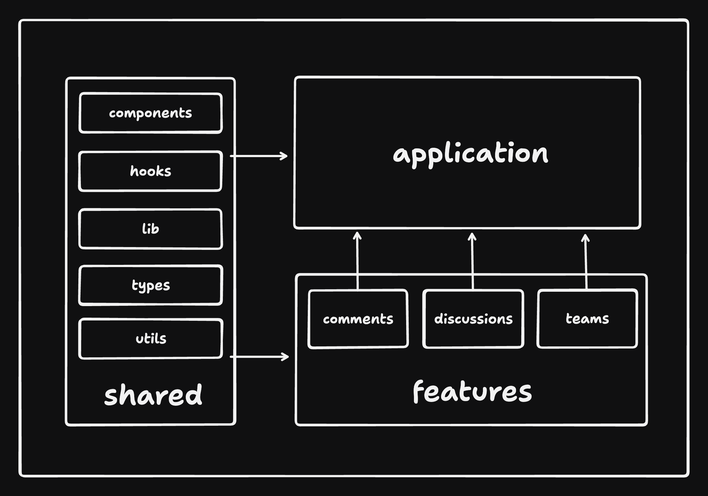

# 🗄️ Project Structure

```
├── README.md                  # Project overview and setup instructions
├── codegen.ts                 # Script for generating types and data fetching functions
├── docs
│   └── project-structure.md   # Documentation on the project's structure
├── index.html                 # Entry point for the HTML, includes root div for React
├── public                     # Static files like images and fonts
├── src                        # Source files for the application
│   ├── @types                 # TypeScript type definitions specific to the project
│   ├── app                    # Core React components and setup
│   │   ├── App.tsx            # Root React component
│   │   ├── main-provider.tsx  # Context providers for the entire app
│   │   ├── main.tsx           # Entry point for React components
│   │   └── routes             # Routing components
│   ├── features               # Feature-specific modules
│   │   └── sample-feature     # Example feature module
│   │       ├── components     # React components for the feature
│   │       ├── hooks          # React hooks for the feature
│   │       ├── utils          # Utility functions
│   │       ├── types          # TypeScript types for the feature
│   │       └── stores         # State management stores
│   ├── lib                    # Libraries and helpers used across the project
│   ├── pages                  # React components that act as pages
│   └── shared                 # Reusable components, hooks, and utilities
│       ├── icons              # SVG icons used across the app
│       ├── api                # API call functions
│       ├── assets             # Static assets like images and global styles
│       ├── components         # Shared React components
│       ├── constants          # Constant values used across the app
│       ├── hooks              # Shared React hooks
│       ├── layout             # Components that deal with layout of the app
│       ├── locales            # Localization files
│       ├── stores             # Shared state management logic
│       ├── styles             # Shared CSS and configuration for styling
│       ├── types              # Shared TypeScript types
│       └── utils              # Utility functions
├── tailwind.config.js         # Configuration for Tailwind CSS
```

## Import Guidelines
To ensure a well-structured and maintainable codebase, the following import rules must be followed:

<!--  -->

### Shared Parts (src/shared):

- Shared parts can be used by any part of the codebase, including other shared parts, features, and the app.
- These include reusable components, hooks, utilities, constants, icons, API call functions, localization files, state management logic, styles, and TypeScript types.

### Features (src/features):

- Feature-specific modules should only import from shared parts.
- Features should not import from other feature modules. This ensures that each feature remains independent and modular.
- Instead of inter-feature imports, compose different features at the application level.

### App (src/app):

- The core React components and setup can import from both shared parts and feature-specific modules.
- This layer is responsible for orchestrating the different features and shared components to build the application.

### Rationale

- Modularity: By restricting inter-feature imports, each feature module remains self-contained and easier to manage.
- Scalability: As the codebase grows, this structure helps prevent tight coupling and dependency issues.
- Reusability: Shared components, hooks, and utilities promote code reuse across the project, reducing redundancy.
- Maintainability: Clear import boundaries help developers understand the project structure and dependencies more easily, facilitating easier maintenance and onboarding.

By adhering to these guidelines, we can ensure a robust, scalable, and maintainable codebase.